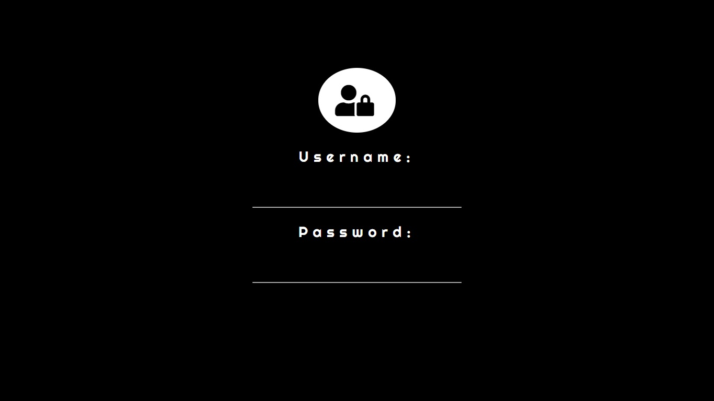
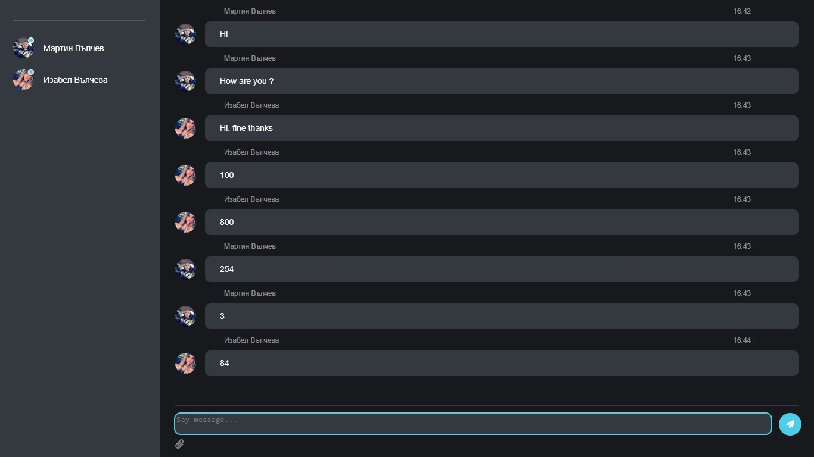
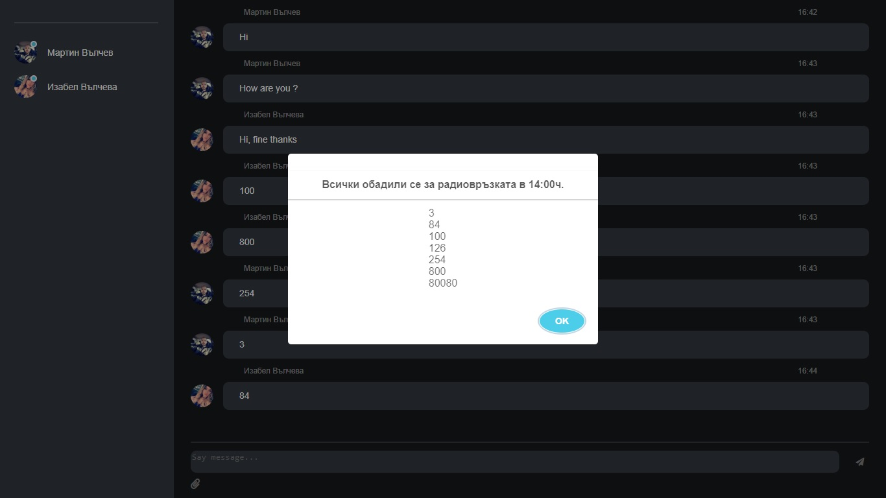

# PointChat

###### Chat client developed with additional features. The program was developed for the purpose of a security company. The program is mainly used by the physical security department.

## Description

The program has been developed to optimize work in the Physical Guard department. All operators at the duty center enter the numbers they receive via a phone call. All information is visualized as a chat window with the operator's name and the exact time. After pressing a button with a paper clip icon. The program only collects numbers and sorts them in descending order. It is then easier to fill in the documentation for operators from the duty center. The client chat can also be used as a regular chat.

##### Test accounts:
###### Username: 
test1
###### Password: 
1234
###### Username: 
test2
###### Password: 
1234
###### Username: 
test3
###### Password: 
1234

## Live On

http://point-chat.herokuapp.com/

## Source Code

https://github.com/MartinValchevv/PointChat

## How To Use

## Technologies

JavaScript, jQuery, Express, socket.io, file-system, Kinvey, CSS and HTML

## Author
Martin Valchev  